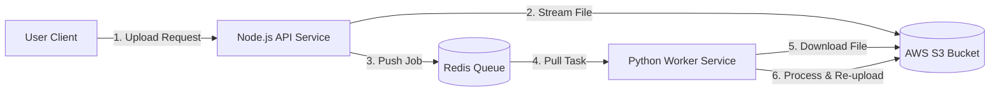

# 🚀 Scalable Async Image Processing Pipeline

    

> **A high-throughput, event-driven microservices architecture designed to handle CPU-intensive tasks without blocking the main application thread.**

---

## 🎥 System Demo

*The system processes images asynchronously across a hybrid cloud environment, ensuring zero-blocking on the client side.*

---

## 🏗 System Architecture



The system decouples **Ingestion (I/O)** from **Processing (CPU)** using a distributed message queue. This ensures the API remains responsive (<50ms latency) even during heavy traffic spikes.

## 🧠 Key Engineering Decisions

### 1. Solving the “Shared State” Problem (The Teleportation Issue)
Initially, I used local Docker volumes to share files between services. However, this fails in a distributed production environment where services run on different physical servers.

* **Solution:** Implemented **AWS S3** as a stateless centralized storage. The API streams uploads directly to S3, and the Worker independently downloads them. This makes the system **horizontally scalable**—we can add 50+ workers across different regions without breaking file access.

### 2. Asynchronous Decoupling
Image processing is CPU-heavy. If handled by the Node.js main thread, one large upload would freeze the server for all other users.

* **Solution:** Offloaded processing to a Python background worker. The API simply acknowledges the request ("Job Received") and lets the user continue immediately.

---

## 📸 Proof of Concept


*Left: Node.js API acknowledging upload | Right: Python Worker processing S3 file*

---

## 🛠 Tech Stack

| Component | Technology | Purpose |
| :--- | :--- | :--- |
| **Ingestion Service** | Node.js, Express, Multer-S3 | Handles uploads + streams directly to S3 |
| **Processing Service** | Python 3.9, Pillow (PIL) | CPU-intensive image manipulation |
| **Message Broker** | Redis | Asynchronous job queue |
| **Object Storage** | AWS S3 | Stateless storage for raw/processed images |
| **Infrastructure** | Docker, Docker Compose | Consistent Dev/Prod environment |

---

## 🚀 How to Run Locally

### Prerequisites
* Docker Desktop installed & running.
* An AWS Account (Access Key & Secret Key).
* An AWS S3 Bucket created.

### 1. Clone the Repository
```bash
git clone [https://github.com/your-username/async-processor.git](https://github.com/your-username/async-processor.git)
cd async-processor
```
## 2. Configure Environment Variables

Create a `.env` file in the root directory.  
**Security Note:** This file is `.gitignored` to protect your AWS keys.

```bash
# .env content
REDIS_URL=redis://redis_db:6379
AWS_REGION=your-region-code   # e.g., ap-south-1
AWS_BUCKET_NAME=your-bucket-name
AWS_ACCESS_KEY_ID=your-access-key
AWS_SECRET_ACCESS_KEY=your-secret-key
```
## 3. Start the Cluster

```bash
docker-compose up --build
```

## 4. Test the Pipeline

1. Open your browser at:  
   **http://localhost:3000**

2. Select an image file and click **Upload**.

3. Watch the terminal logs for real-time processing status.

4. Check your AWS S3 Bucket for the new **processed/** folder.

---

## 🔮 Future Improvements

### **WebSockets**
Implement real-time notifications to the client when processing is complete.

### **Dead Letter Queue (DLQ)**
Move failed jobs (e.g., corrupt images) into a separate inspection queue.

### **Kubernetes**
Migrate from Docker Compose to Kubernetes (K8s) for automatic scaling based on Redis queue depth.


